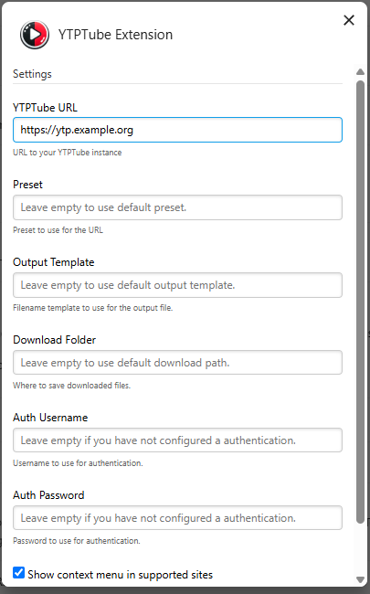
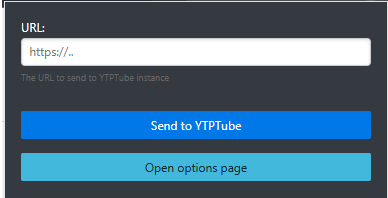

# A YTPTube extension

This extension can be used in `Chrome/Chromium browsers` and `Firefox` to add URLs
to [YTPTube](https://github.com/arabcoders/ytptube) instance.

## Screenshots

 

## Installation from store

- Install from [Firefox for desktop or Android](https://addons.mozilla.org/en-US/firefox/addon/ytptube-extension/)
- Install from [Chrome/Chromium Browsers](https://chromewebstore.google.com/detail/ytptube-extension/kiepfnpeflemfokokgjiaelddchglfil)

## Usage

Configure the extension to point to your YTPTube instance in the extension options page.

In **Authentication**, enter an API key. Leave it empty when server authentication is disabled.

## For issues

To report issues, please use [GitHub issues page](https://github.com/arabcoders/ytptube/issues).
